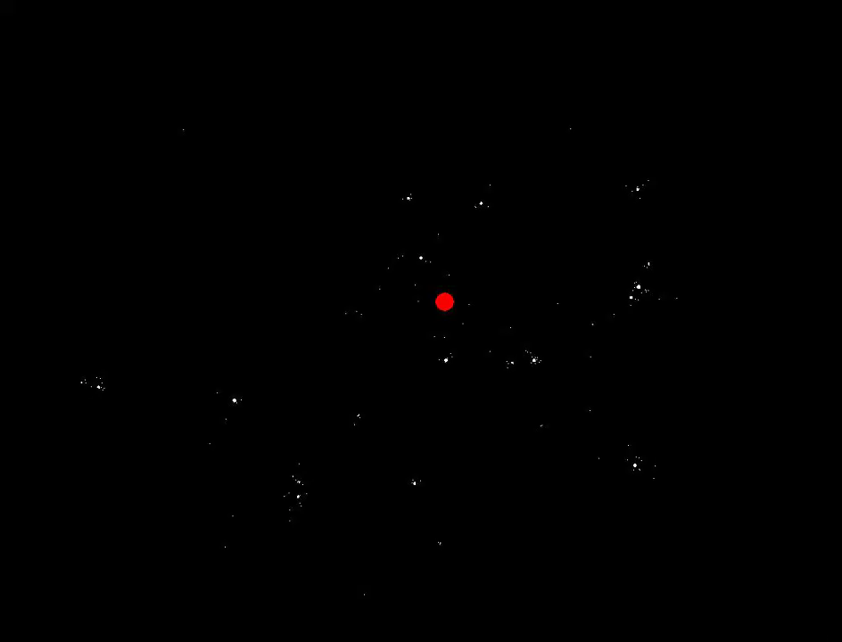
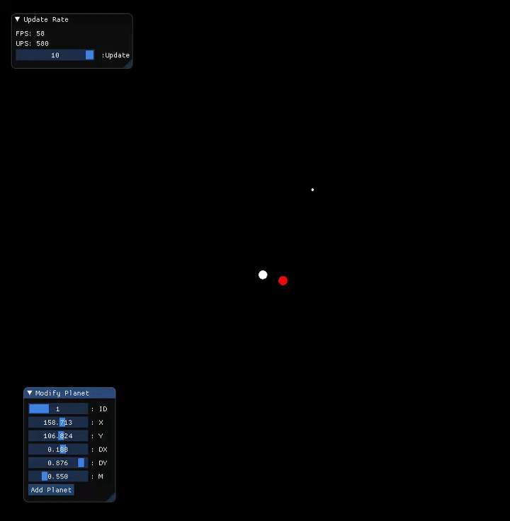

# SolarSim
A solar simulation to demonstrate multi-threading and SIMD
Forgive the gif framerate. The screen capture software was competing for compute resources with the simulation   
The original code runs 1k planets at 50 million force calculations per second  
The fastest manages 9k planets at 6 billion force calculations per second  
I managed with simd and threading to gain a 120x speedup and will possibly learn compute shaders for even more compute power.  

