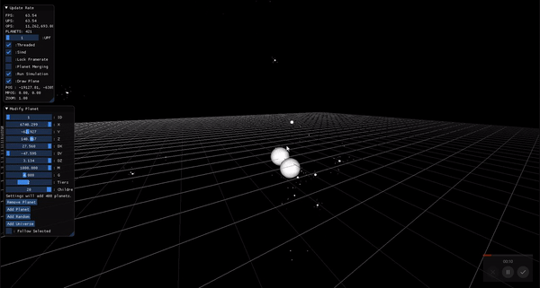
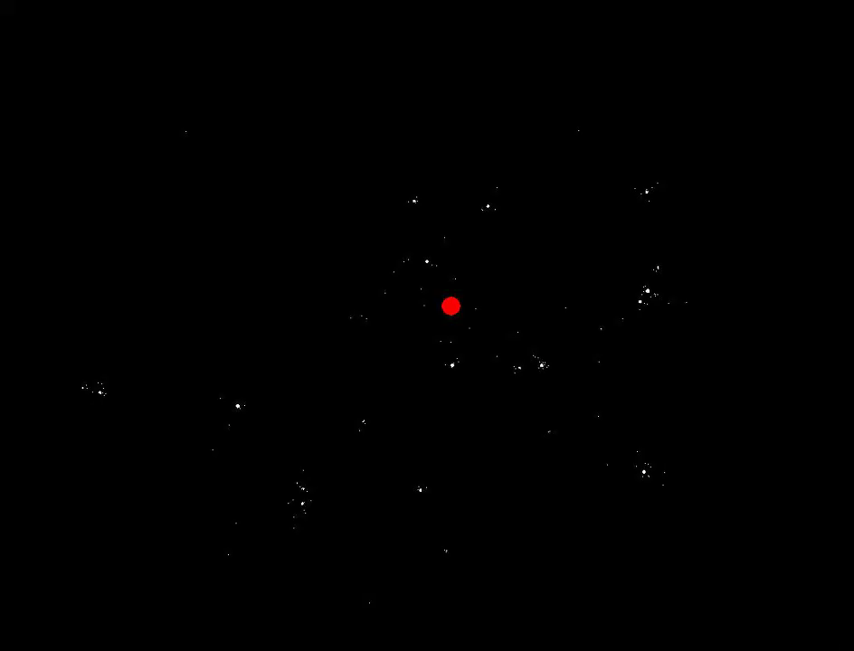
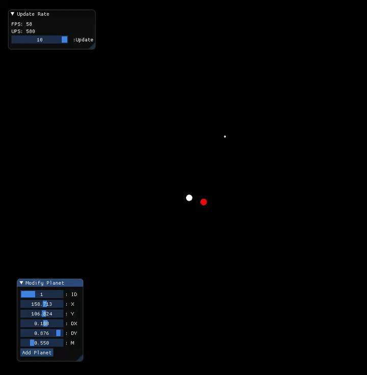
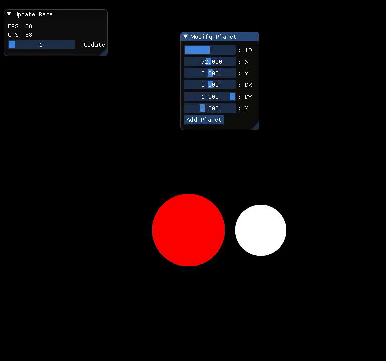

# SolarSim
A solar simulation to demonstrate gravity and the power of multithreading and SIMD.
Two great little apps that can be used in the classroom!
## Now in 3D!
  
  
## 2D Version is great for volume
  
  
  
